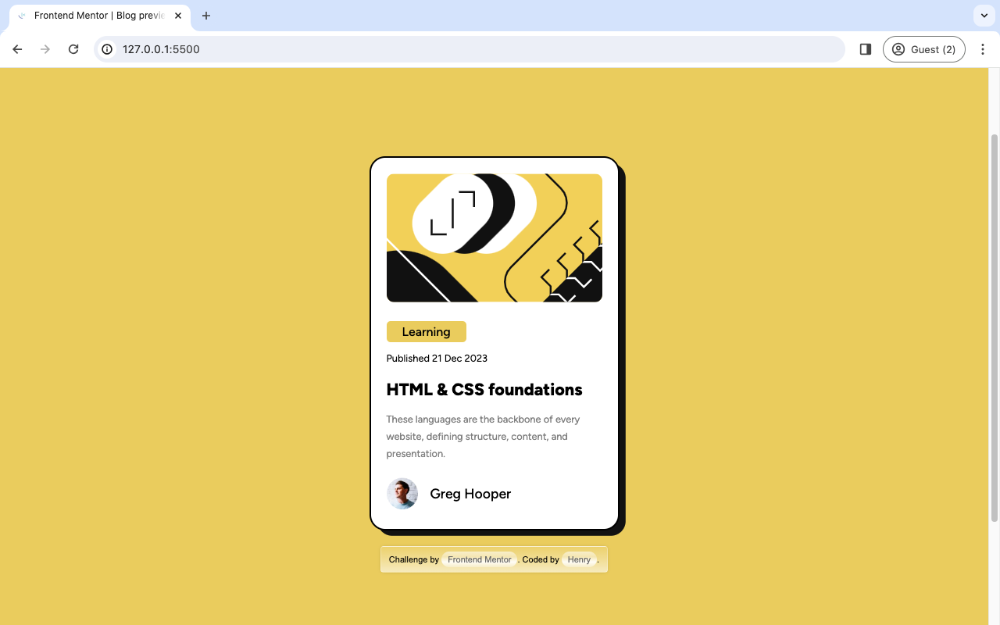

# Frontend Mentor - Blog preview card solution

This is a solution to the [Blog preview card challenge on Frontend Mentor](https://www.frontendmentor.io/challenges/blog-preview-card-ckPaj01IcS). Frontend Mentor challenges help you improve your coding skills by building realistic projects. 

## Table of contents

- [Overview](#overview)
  - [The challenge](#the-challenge)
  - [Screenshot](#screenshot)
  - [Links](#links)
- [My process](#my-process)
  - [Built with](#built-with)
  - [What I learned](#what-i-learned)
  - [Continued development](#continued-development)
  - [Useful resources](#useful-resources)
- [Author](#author)
- [Acknowledgments](#acknowledgments)

## Overview

### The challenge

Users should be able to:

- See hover and focus states for all interactive elements on the page

### Screenshot

### Links

- Solution URL: [Add solution URL here](https://your-solution-url.com)
- Live Site URL: [Add live site URL here](https://your-live-site-url.com)

## My process

### Built with

- Semantic HTML5 markup
- CSS custom properties
- Flexbox

### What I learned

### Continued development
- Reprogramming this using a different framework

### Useful resources

- [Conquering Responsive Layout](https://courses.kevinpowell.co/view/courses/conquering-responsive-layouts) - This helped me for building a responsive layout. I really liked his pattern and will continue to practice it going forward.

## Author

- Website - [blog-preview_card](https://blog-preview-card-wine-eight.vercel.app/)
- Frontend Mentor - [@stan545](https://www.frontendmentor.io/profile/stan545)
- Twitter - [@stanhenry4](https://www.twitter.com/stanhenry4)

## Acknowledgments
- ...